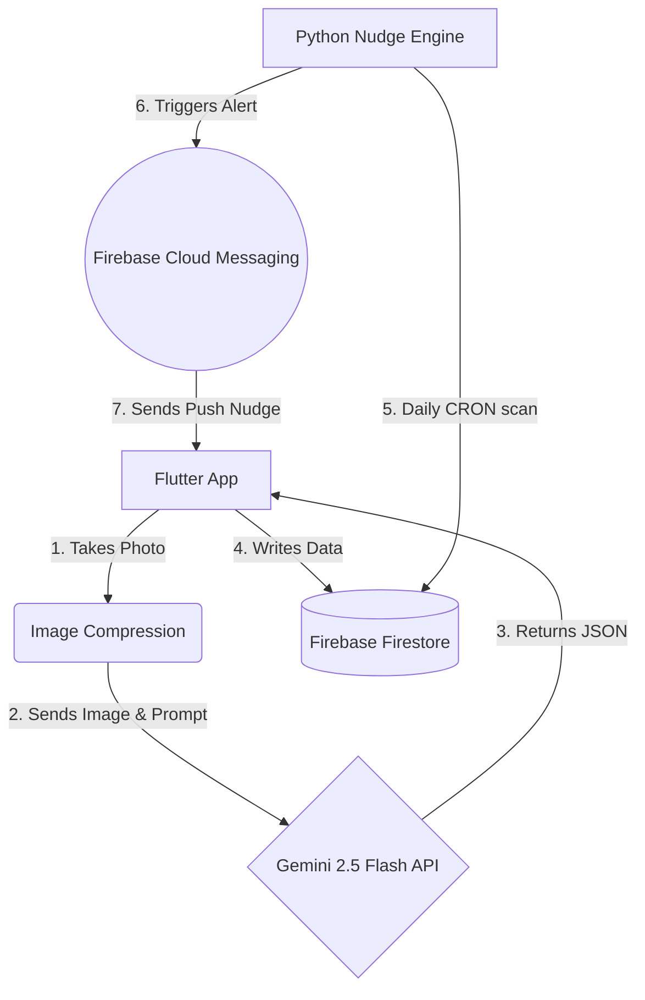

# 🍃 FridgeGuardian

_**KitaHack 2026 Submission**_ | A smart, zero-waste fridge management system powered by Gemini 2.5 Flash and Firebase.
  
## 🎯 The Mission

In Malaysia, thousands of tonnes of food are wasted daily. FridgeGuardian is designed to tackle **SDG 12 (Responsible Consumption and Production)** and **SDG 13 (Climate Action)**.

Unlike traditional inventory apps that rely on manual data entry, FridgeGuardian uses computer vision to track your food and acts as a behavioral intervention tool to gently "nudge" users away from over-purchasing.

## 📱 App Preview

| 📸 1. The Home Page | 📸 2. Smart Vision Scan | 🧠 3. Behavioral Insights | 🚨 4. The Nudge Engine |
| :---: | :---: | :---: | :---: |
|  |  |  |  |
| *Homepage Design. The overall record are appear here.* |*Fridge Scan Design. No manual typing or data entry required.* | *AI automatically extracts expiry dates and analyzes your waste patterns.* | *The AI sates the ways to handle food before it spoils.* |

## ✨ Key Features (The USP)

**📸 Vision-Powered Logging:** Snap a picture of your fridge. The AI automatically extracts food items, quantities, and estimates expiry dates.

**🧠 Behavioral Nudges:** The AI analyzes your storage patterns and provides actionable advice (e.g., "You frequently leave 1L milk unfinished. Consider buying the 500ml carton next time.").

**🌍 Carbon Impact Tracker:** Automatically calculates the $CO_2$ emissions saved when food is successfully consumed or shared rather than thrown away.

**🤝 Community Bridge:** Flags surplus items that are unlikely to be finished, suggesting them for community donation before they expire.

## 🏗️ Tech Stack & $0 Architecture

To ensure maximum accessibility and maintain a strict **$0 budget**, this project is built on a highly efficient, serverless architecture:

- **Frontend:** Flutter (Dart)
- **AI Engine:** Google Gemini 2.5 Flash API (Free Tier)
- **Database & Auth:** Firebase Cloud Firestore & Firebase Auth (Spark Plan)

## ⚙️ System Architecture

To keep our solution highly scalable and completely free ($0), we decoupled the AI processing from standard Cloud Functions:

Architecture Note: To avoid the mandatory billing requirements of Cloud Functions, the AI orchestration is securely handled within the Flutter application. The client processes the image, retrieves the structured JSON from Gemini, and performs batch writes directly to Firestore using secure security rules.

## 🚀 Getting Started (Local Setup)

Follow these steps to run the project locally.

**1. Prerequisites**
- [Flutter SDK](https://docs.flutter.dev/install) installed.
- A Firebase project (Spark plan is sufficient).
- A [Google Gemini API Key](https://aistudio.google.com/app/api-keys).

**2. Clone the Repository:**

In Bash:

    git clone https://github.com/your-username/kitahack2026.git \
    cd kitahack2026/flutter_application_1

**3. Environment Setup (Crucial)**
 
   You must provide your own Gemini API key. Create a `.env` file in the root directory of the Flutter project `(flutter_application_1/.env)` and add your key:

    # Do not commit this file to version control!
    GEMINI_API_KEY=your_actual_api_key_here

**4. Firebase Configuration**
   1. Register your Android/iOS app in your Firebase Console.
 
   2. Download the `google-services.json` (for Android) and place it in `android/app/`.
 
   3. Ensure **Firestore and Email/Password Authentication** are enabled in your Firebase Console.

**5. Run the App** 

In Bash:

    flutter pub get
    flutter run

## 🛠️ How We Built It & Challenges Overcome
* **AI Vision Latency:** Initially, sending raw phone images to Gemini took over 20 seconds. We built a pre-processing layer in Flutter to compress images, reducing AI inference time to under 4 seconds without losing vision quality.
* **The Zombie Food Bug:** We had to write complex compound queries in Firestore to ensure our Python Nudge Engine only alerted users about food that was *expiring* AND still marked as *active* (not yet consumed).

## 📊 Environmental Impact Tracking
Every time a user consumes or shares an item instead of throwing it away, our `ImpactAggregator` logs the transaction. Using a standard emission factor, we gamify the experience by showing users exactly how many kg of CO₂ they have saved, directly answering **SDG 13**.

## 🔐 Security Notes
  
  - **API Keys:** The `.env` file is included in `.gitignore` to prevent accidental credential leaks.
  
  - **Database:** Firestore is protected by strict Security Rules ensuring users can only read and write to their own isolated `inventory` collections based on their `uid`.

#### Built with ❤️ for KitaHack 2026
## 👨‍💻 The Team
* **[Looi Yu Zhi]** - [Team Leader & Idea provider & Documentation Lead] 
* **[Vincent Loh Yong Sheng]** - [Frontend (FLutter) Lead] 
* **[Goh Pei Jia]** - [Backend (Firebase & Gemini API) & GitHub Lead]
* **[Daniel Goh Zhi Qian]** - [AI Lead]
