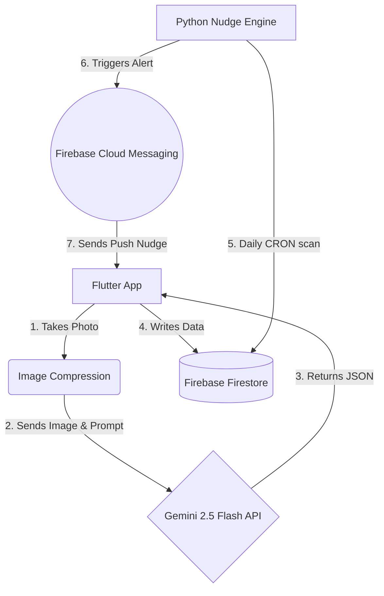

# 🍃 FridgeGuardian

_**KitaHack 2026 Submission**_ | A smart, zero-waste fridge management system powered by Gemini 2.5 Flash and Firebase.
  
## 🎯 The Mission

In Malaysia, thousands of tonnes of food are wasted daily. FridgeGuardian is designed to tackle **SDG 12 (Responsible Consumption and Production)** and **SDG 13 (Climate Action)**.

Unlike traditional inventory apps that rely on manual data entry, FridgeGuardian uses computer vision to track your food and acts as a behavioral intervention tool to gently "nudge" users away from over-purchasing.

## 📱 App Preview

| 😃 1. The Login Page | 📸 2. The Home Page | 📸 3. Smart Vision Scan | 🧠 4. Behavioral Insights | 🚨 5. The Nudge Engine |
| :---: | :---: | :---: | :---: |:---: |
|  |  |  |  |  |
|  |  |  |  |  |
| *Login Design. User can sign in or continue as guest to use the app.* | *Homepage Design. The overall record are appear here.* |*Fridge Scan Design. No manual typing or data entry required.* | *AI automatically extracts expiry dates and analyzes your waste patterns.* | *The AI sates the ways to handle food, user can press the comsumed button to notice the CO_2 emissions saved* |

## ✨ Key Features (The USP)

**🔐 Secure User Profiles:** Seamless login powered by Firebase Authentication ensures your virtual fridge inventory, behavioral data, and carbon reduction points are safely synced and personalized just for you.

**📸 Vision-Powered Logging:** Snap a picture of your fridge. The AI automatically extracts food items, quantities, and estimates expiry dates—no manual data entry required.

**🧠 Behavioral Nudges:** The AI analyzes your storage patterns and provides actionable advice (e.g., "You frequently leave 1L milk unfinished. Consider buying the 500ml carton next time.").

**🚨 Proactive Push Notifications**: A dedicated backend "Nudge Engine" tracks your database daily, sending timely push alerts to your phone to cook expiring food or share unfinishable surplus with your community.

**🌍 Carbon Impact Tracker:** Automatically calculates the $CO_2$ emissions saved when food is successfully consumed or shared rather than thrown away, directly gamifying your eco-impact.


## 🏗️ Tech Stack & $0 Architecture
To ensure maximum accessibility and maintain a strict **$0 budget**, this project is built on a highly efficient, serverless architecture:

- **Frontend:** Flutter (Dart)
- **Database & Auth:** Firebase Cloud Firestore & Firebase Auth (Spark Plan)
- **AI Engine:** Google Gemini 2.5 Flash API (Free Tier)

+  Flutter \
Flutter is Google’s open-source UI software development toolkit designed to build natively compiled applications for mobile, web, and desktop from a single codebase. We chose Flutter over alternatives like React Native or traditional native development (Swift for iOS /Kotlin for Android) primarily for its development speed and cross-platform consistency. By utilizing a single codebase, our small team could simultaneously deploy FridgeGuardian to both iOS and Android without duplicating effort. Furthermore, Flutter’s highly customizable, widget-based architecture was essential for quickly building and iterating on our custom UI elements, such as the visual "Quick-Tap" produce grid and the Urgent Action Dashboard, ensuring a fluid, native-feeling, and visually consistent user experience across all devices.

+ \ Firebase \
Firebase is Google’s comprehensive Backend-as-a-Service (BaaS) platform, providing scalable cloud infrastructure, real-time databases, authentication, and push notification services. We selected Firebase over alternatives like AWS Amplify or building a custom Node.js/PostgreSQL backend from scratch because it drastically reduced our infrastructure overhead and integrates seamlessly with Flutter. We rely on Cloud Firestore’s NoSQL structure to rapidly handle the high-velocity read and write operations of user food inventories. Additionally, we utilize Firebase Authentication for secure anonymous user sessions, Firebase Storage for handling user image uploads, and Firebase Cloud Messaging (FCM) to reliably deliver our critical in-app pop-up alerts for expiring food. Choosing Firebase allowed us to completely bypass server maintenance and focus our engineering efforts directly on our core features and Gemini AI integration.

+ \ Google AI Studio & Gemini API \
Google AI Studio is a developer-focused prototyping environment and console used to experiment with and deploy Google's generative AI, while the Gemini API provides the direct programmatic access needed to integrate that AI into our application's backend. We chose the Gemini API over alternatives (like OpenAI's GPT models) specifically for its native multimodal capabilities, which effortlessly process both our text-based inventory constraints and visual image inputs. Furthermore, Google AI Studio was selected as our development workspace because it provided the most frictionless, secure pathway to test our prompt engineering, generate our API keys, and seamlessly connect the AI logic directly into our existing Firebase and Flutter architecture.


## ⚙️ System Architecture

To keep our solution highly scalable and completely free ($0), we decoupled the AI processing from standard Cloud Functions:



Architecture Note: To avoid the mandatory billing requirements of Cloud Functions, the AI orchestration is securely handled within the Flutter application. The client processes the image, retrieves the structured JSON from Gemini, and performs batch writes directly to Firestore using secure security rules.

# FridgeGuardian — Complete Setup Guide

> **Cross-Platform**: FridgeGuardian runs as a **native mobile app** (Android/iOS) and a **responsive web application** accessible from any browser — all from a single Flutter codebase.

---

## Prerequisites

| Tool | Required Version | How to Install |
|------|-----------------|---------------|
| **Flutter SDK** | 3.41.2+ (stable) | https://docs.flutter.dev/get-started/install |
| **Dart SDK** | 3.11.0+ (bundled with Flutter) | Comes with Flutter |
| **Git** | Any recent version | https://git-scm.com/downloads |
| **Chrome** | Any recent version | For web version |
| **Android Studio** | Latest (for Android SDK + emulator) | https://developer.android.com/studio |
| **VS Code** *(recommended)* | Latest | With Flutter & Dart extensions |

---

## Step 1: Clone the Repository

```bash
git clone https://github.com/Gohpeijia/KitaHack2026.git
cd KitaHack2026/flutter_application_1
```

---

## Step 2: Create the `.env` File

The `.env` file is **gitignored** for security and must be created manually.

Inside the `flutter_application_1/` folder (same level as `pubspec.yaml`), create a file named `.env`:

```env
GEMINI_API_KEY="YOUR_GEMINI_API_KEY_HERE"
GEMINI_MODEL="gemini-2.5-flash-lite"
```

### How to get a Gemini API key (free):
1. Go to https://aistudio.google.com/apikey
2. Sign in with a Google account
3. Click **"Create API key"**
4. Copy the key and paste it into the `.env` file

> **Important:** The `.env` file is loaded as a Flutter asset (listed in `pubspec.yaml` under `assets:`). It must be at the root of `flutter_application_1/` — do NOT put it in a subfolder.

---

## Step 3: Install Dependencies

```bash
flutter pub get
```

This installs all packages:

| Package | Purpose |
|---------|---------|
| `google_generative_ai` | Gemini AI SDK (image analysis, barcode lookup, nudge generation) |
| `firebase_core` | Firebase initialization |
| `cloud_firestore` | Real-time NoSQL database for inventory & user profiles |
| `firebase_auth` | Email/password + anonymous guest authentication |
| `firebase_storage` | Fridge scan image uploads |
| `firebase_messaging` | FCM push notifications |
| `flutter_local_notifications` | Scheduled local expiry reminders (mobile) |
| `timezone` / `flutter_timezone` | Timezone-aware notification scheduling |
| `mobile_scanner` | Barcode scanning via device camera (mobile) |
| `image_picker` | Camera / gallery image selection |
| `flutter_dotenv` | Secure environment variable loading |

---

## Step 4: Verify Flutter Setup

```bash
flutter doctor
```

Ensure there are no critical errors for your target platform (Web, Android, or Windows).

---

## Running the App

### Option A: Web (Chrome) — Works on Any Desktop

```bash
flutter run -d chrome
```

Opens FridgeGuardian in Chrome. **All features work on web** including:
- Fridge image scanning (upload from gallery)
- AI analysis via Gemini
- Inventory management, suggestions, dashboard
- Firebase Auth (email/password + guest login)
- Cloud Firestore real-time sync
- FCM push notifications (via service worker)
- In-app notification overlays for expiry alerts
- Smart Grocery List with buy-less warnings

> **Note:** Barcode scanning requires native camera access and is **mobile-only**. On web, it falls back to demo mode.

---

### Option B: Android Phone (Full Feature Set)

**Requirements:**
- Android phone with USB debugging enabled
- USB cable connected to PC

**Steps:**

1. **Enable Developer Options** on your phone:
   - Settings → About Phone → tap **"Build Number"** 7 times

2. **Enable USB Debugging**:
   - Settings → Developer Options → USB Debugging → **ON**

3. **Connect phone via USB** and accept the debugging prompt on phone

4. **Verify device is detected:**
   ```bash
   flutter devices
   ```
   You should see your device listed (e.g., `Honor 200 Pro (mobile) • AE6RUT4611040768`)

5. **Run the app:**
   ```bash
   flutter run -d <DEVICE_ID>
   ```
   Or if only one device is connected:
   ```bash
   flutter run -d android
   ```

**All features work on Android** including:
- ✅ Real-time barcode scanning with camera (torch toggle + camera switch)
- ✅ Fridge photo scanning (camera or gallery)
- ✅ Native push notifications + local scheduled reminders at 9 AM
- ✅ Everything from the web version

> After the app is installed on your phone, it **runs independently** — you can unplug the USB cable.

---

### Option C: Android Emulator

```bash
# List available emulators
flutter emulators

# Launch an emulator
flutter emulators --launch <emulator_name>

# Run the app
flutter run -d android
```

> **Note:** Camera/barcode features require a physical device. Emulator runs everything else.

---

### Option D: Windows Desktop App

```bash
flutter run -d windows
```

Same features as the web version. Firebase, Gemini AI, and notifications all work. Barcode scanning is not available on desktop.

---

### Option E: iOS (macOS only)

Requires a Mac with Xcode installed.

```bash
# Open iOS simulator
open -a Simulator

# Run
flutter run -d ios
```

> **Note:** The `ios/Runner/GoogleService-Info.plist` file is **not included** in the repo. You need to download it from the [Firebase Console](https://console.firebase.google.com/) → Project Settings → iOS app → download `GoogleService-Info.plist` → place it in `ios/Runner/`.

---

## Firebase Project Info

The app is pre-configured to use an existing Firebase project. **No additional Firebase setup is needed** — just create the `.env` file and run.

| Setting | Value |
|---------|-------|
| **Project ID** | `kitahack2026-c2a42` |
| **Auth Domain** | `kitahack2026-c2a42.firebaseapp.com` |
| **Storage Bucket** | `kitahack2026-c2a42.firebasestorage.app` |
| **Plan** | Spark (Free) |

### Firebase configuration files (already in repo):
- `lib/firebase_options.dart` — Platform-specific Firebase config (auto-generated by FlutterFire CLI)
- `android/app/google-services.json` — Android Firebase config
- `web/firebase-messaging-sw.js` — Web push notification service worker

### Firebase services used:
| Service | Purpose |
|---------|---------|
| **Authentication** | Email/password registration + anonymous guest login |
| **Cloud Firestore** | Inventory storage, user profiles, FCM device tokens |
| **Firebase Storage** | Fridge scan image uploads |
| **Firebase Cloud Messaging** | Push notifications across all platforms |

### Firestore Security Rules:
```
Users can only read/write their own data (request.auth.uid == userId)
```

---

## Project Structure

```
KitaHack2026/
├── flutter_application_1/              ← Main app code
│   ├── lib/
│   │   ├── main.dart                   ← Entry point (Firebase init + dotenv load)
│   │   ├── firebase_options.dart       ← Firebase config (all platforms)
│   │   ├── ui/
│   │   │   ├── fridgeguardian_demo.dart    ← Main app (all screens + logic)
│   │   │   └── auth_screen.dart            ← Login / register screen
│   │   └── service/
│   │       ├── gemini_service.dart         ← Gemini AI with 4-model rotation
│   │       └── impact_aggregator.dart      ← CO2 impact calculation
│   ├── .env                            ← API keys (NOT in repo — create manually)
│   ├── .env.example                    ← Template for .env
│   ├── pubspec.yaml                    ← Dependencies
│   ├── web/
│   │   ├── index.html                  ← Web entry point + FCM setup
│   │   └── firebase-messaging-sw.js    ← Background push notification handler
│   └── android/
│       └── app/
│           ├── google-services.json         ← Firebase Android config
│           └── src/main/AndroidManifest.xml ← Permissions (Camera, Notifications)
├── dataconnect/                        ← Firebase Data Connect config
├── firestore.rules                     ← Firestore security rules
├── firestore.indexes.json              ← Firestore indexes
└── README.md
```

---

## Feature Availability by Platform

| Feature | Web (Chrome) | Android | Windows | iOS | 
|---------|:---:|:---:|:---:|:---:|
| Fridge Image Scan (AI) | ✅ Gallery | ✅ Camera + Gallery | ✅ Gallery | ✅ Camera + Gallery |
| Barcode Scanning | ❌ Demo only | ✅ Real camera | ❌ | ✅ Real camera |
| AI Inventory Analysis (Gemini) | ✅ | ✅ | ✅ | ✅ |
| Firebase Auth (Email + Guest) | ✅ | ✅ | ✅ | ✅ |
| Cloud Firestore Sync | ✅ | ✅ | ✅ | ✅ |
| Push Notifications (FCM) | ✅ | ✅ | ✅ | ✅ |
| Local Scheduled Reminders (9AM) | ❌ | ✅ | ❌ | ✅ |
| In-App Notification Overlay | ✅ | ✅ | ✅ | ✅ |
| Smart Grocery List | ✅ | ✅ | ✅ | ✅ |
| Dashboard & KPIs | ✅ | ✅ | ✅ | ✅ |
| Demo Mode (Offline) | ✅ | ✅ | ✅ | ✅ |

---

## Troubleshooting

| Problem | Solution |
|---------|----------|
| `flutter pub get` fails | Run `flutter clean` then `flutter pub get` |
| `.env` not loading / API key error | Ensure `.env` is in `flutter_application_1/` root (same level as `pubspec.yaml`) and contains `GEMINI_API_KEY="your-key"` |
| Firebase auth fails | The Firebase project must have **Email/Password** and **Anonymous** sign-in enabled in the [Firebase Console](https://console.firebase.google.com/) → Authentication → Sign-in method |
| Android build fails | Run `flutter doctor` and fix Android toolchain issues. Ensure **Java 17+** is installed. |
| Barcode scanner doesn't open (web) | Barcode scanning is **mobile-only**. On web it adds a demo item instead. |
| "Gemini quota exceeded" | The free tier allows ~20 requests/day per model. The app auto-rotates through **4 Gemini models** (~80 requests/day total). Wait for the countdown timer or try again later. |
| Notifications not working (web) | Allow notification permissions in browser when prompted. Verify `web/firebase-messaging-sw.js` exists. |
| Phone not detected | Enable USB debugging, try a different USB cable, or run `adb devices` to verify connection. |
| iOS missing `GoogleService-Info.plist` | Download from Firebase Console → Project Settings → iOS app → place in `ios/Runner/` |

---

## Quick Start (TL;DR)

```bash
# 1. Clone
git clone https://github.com/Gohpeijia/KitaHack2026.git
cd KitaHack2026/flutter_application_1

# 2. Create .env file with your Gemini API key
echo 'GEMINI_API_KEY="your-key-here"' > .env

# 3. Install dependencies
flutter pub get

# 4. Run on web
flutter run -d chrome

# 4. OR run on Android phone
flutter run -d android
```


## 🛠️ Implementation & Challenges Overcome
### The Challenge: Enforcing Structured Data Parsing from Non-Deterministic AI
**What it was:**  Our most significant technical hurdle was reliably converting the Gemini API's generative text output into a structured format that our Flutter frontend could read and display as a polished UI (Recipe Title, Ingredients List, and Cooking Steps) without crashing the application.

**Why it was challenging:**  Large Language Models are inherently conversational and non-deterministic. Even when explicitly prompted to "Output the recipe as JSON," the Gemini API would occasionally return the JSON wrapped in Markdown formatting (e.g.,`json { ... }` ) or prepend conversational filler (e.g., "Here is a great recipe for your expiring spinach! \n { ... }"). Because Dart (Flutter's language) has a very strict `jsonDecode()` function, any presence of this extra text would immediately throw a `FormatException`, causing the "Inspire Me" recipe screen to crash completely.


### Failed Approaches (The Debugging Process):
1. **"Prompt Begging":**  Initially, we tried solving this purely through prompt engineering. We added capitalized warnings: "CRITICAL: Output ONLY valid JSON. Do not add any conversational text." While this reduced the error rate, it did not eliminate it. The app still crashed randomly, which is unacceptable for user retention.
2. **String Manipulation (Regex):** Next, we attempted to write a custom Dart function using Regular Expressions (Regex) to strip away markdown backticks and extract only the text found between the first `{` and last `}` brackets. This approach failed because recipes with complex, nested arrays of ingredients often confused the regex logic, resulting in corrupted, unreadable data.

### **The Solution (Step-by-Step):**
To solve this permanently, we moved away from "hacky" string manipulation and leveraged proper API configuration and strict data modeling.

1. **API-Level Constraint (Structured Outputs):** Instead of relying on the prompt text to dictate the format, we updated our Gemini API call configuration. We utilized the Google AI API's  `response_mime_type: "application/json"` parameter. This forced the model at the architecture level to return a pure JSON string, entirely eliminating the markdown wrapper and conversational filler.

2. **Strict Schema Definition:** To guarantee the keys always matched our app's expectations, we passed a structured JSON Schema in the API request payload. We explicitly defined the required structure: a string for `recipeName`, an array of strings for `ingredients`, and an array of strings for `steps`.

3. **Graceful Exception Handling:** We wrapped the parsing logic in a `try-catch` block. If a rare parsing error did occur, instead of showing a red crash screen, the app caught the exception and triggered a seamless UI fallback—displaying a friendly "Refining your recipe..." loading animation while the backend automatically retried the API call.
   
### Tools Chosen to Solve It:

- **Google AI Studio / Gemini API:** Utilized for its advanced configuration parameters (`response_mime_type` and Schema definitions) to constrain model outputs.

- **Flutter (Dart):** Utilized for strict object-oriented data modeling and robust exception handling.

**The Impact:** T The stability of our core AI feature went from approximately 70% to 99.9%. By completely eliminating JSON parsing crashes, the app transformed from a fragile prototype into a reliable, production-ready tool. Users experienced a seamless, uninterrupted flow from receiving an expiry warning to viewing an actionable recipe, ensuring the app successfully fulfilled its mission of preventing food waste.

## 🛣️ Future Roadmaps
To ensure the FridgeGuardian can seamlessly transition from a localized pilot to a mass-market platform, the underlying technical architecture was designed with horizontal scalability at its core. The implementation choices made during our iterative testing phase deliberately laid the groundwork for rapid audience growth.

### Phase 1: Short-Term (0–6 Months) - Feature Refinement & Localized Rollout
**The Goal:** Eliminate the final barriers to daily usage and expand from our small beta group to a broader, localized user base.

- **Specific Action - OCR Receipt Scanning:** Building upon our barcode scanner, we will implement Optical Character Recognition (OCR) technology. This allows users to simply snap a photo of their printed grocery receipt. The system will automatically parse the text, identify the food items, estimate their expiry dates, and populate the inventory in seconds.

- **Expansion Plan & Audience Reach:** We will launch a localized "Public Beta" targeting 500–1,000 users. To acquire these users efficiently, we will partner with specific residential community boards (e.g., high-density urban apartment complexes) or university student housing associations. We will market the app as a tool specifically designed to help them combat rising grocery inflation.

### Phase 2: Medium-Term (6–12 Months) - Ecosystem Integration & Gamification

**The Goal:** Increase long-term user retention and incentivize organic growth (word-of-mouth) by making the system rewarding and hands-free.
- **Specific Action - Voice Assistant IoT & Gamification:** IoT: We will build integrations for Google Assistant and Amazon Alexa, allowing users to update their inventory hands-free while cooking (e.g., "Alexa, tell Food Manager I used the last of the milk").

- **Gamification:** We will introduce a "Waste Reduction Leaderboard" and a "Green Streak" system, tracking how many consecutive weeks a household goes without throwing away expired food.

- **Expansion Plan & Audience Reach:** We will implement an affiliate/referral program tied to local grocery chains. Users who maintain a high "Green Streak" will unlock digital discount coupons for participating supermarkets. This creates a mutually beneficial B2B partnership: supermarkets get increased customer loyalty, and our platform gains access to the supermarket's massive customer base for rapid audience expansion
  
### Phase 3: Long-Term (12–24+ Months) - Automated Syncing & NGO Logistics Network

**The Goal:** Achieve a frictionless user experience through automation and transition the platform into a powerful community-driven "Zero Waste" network.

- **Specific Action - E-Commerce APIs & Direct NGO Dispatch:**

  - **API Syncing:**We will integrate directly with the APIs of major grocery delivery platforms (like GrabMart, Instacart, or local supermarket apps). When a user checks out online, their digital inventory is instantly and automatically updated in the background without any manual scanning or photos required.


  - **Direct NGO Dispatch & Rapid Redistribution:** We will build a dedicated portal and API for local Non-Governmental Organizations (NGOs) and food rescue charities. If a user realizes they cannot consume an item before its expiry date, they can tap an **"Urgent Donate"** button. This sends a real-time location ping to partnered NGOs, allowing them to dispatch a volunteer to collect the food directly from the user's doorstep. The NGO can then instantly redistribute these perfectly good items to homeless shelters, orphanages, and old folks' homes, completely closing the food waste loop.

- **Expansion Plan & Audience Reach:** With robust data proving our impact on reducing greenhouse gas emissions (SDG 13) and halving consumer waste (SDG 12.3), we will pivot to a B2B2C model. We will pitch the platform to municipal governments and city councils as a subsidized "Smart City" utility. By securing government partnerships or sustainability grants, the app can be rolled out city-wide as an official tool for residents to reduce local landfill burdens while actively supporting the community's vulnerable populations, capturing tens of thousands of users simultaneously.

## 🔐 Security Notes
  
  - **API Keys:** The `.env` file is included in `.gitignore` to prevent accidental credential leaks.
  
  - **Database:** Firestore is protected by strict Security Rules ensuring users can only read and write to their own isolated `inventory` collections based on their `uid`.

#### Built with ❤️ for KitaHack 2026
## 👨‍💻 The Team
* **[Looi Yu Zhi]** - [Team Leader & Idea provider & Documentation Lead] 
* **[Vincent Loh Yong Sheng]** - [Frontend (FLutter) Lead] 
* **[Goh Pei Jia]** - [Backend (Firebase) & GitHub Lead]
* **[Daniel Goh Zhi Qian]** - [AI Lead]
