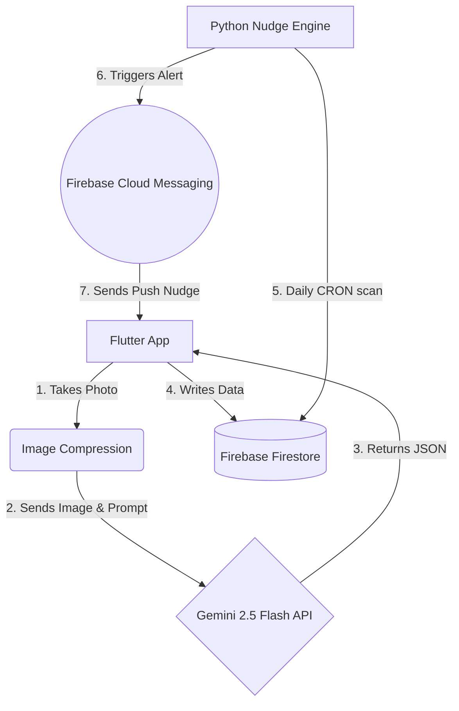

# 🍃 FridgeGuardian

_**KitaHack 2026 Submission**_ | A smart, zero-waste fridge management system powered by Gemini 2.5 Flash and Firebase.
  
## 🎯 The Mission

In Malaysia, thousands of tonnes of food are wasted daily. FridgeGuardian is designed to tackle **SDG 12 (Responsible Consumption and Production)** and **SDG 13 (Climate Action)**.

Unlike traditional inventory apps that rely on manual data entry, FridgeGuardian uses computer vision to track your food and acts as a behavioral intervention tool to gently "nudge" users away from over-purchasing.

## 📱 App Preview

| 😃 1. The Login Page | 📸 2. The Home Page | 📸 3. Smart Vision Scan | 🧠 4. Behavioral Insights | 🚨 5. The Nudge Engine |
| :---: | :---: | :---: | :---: |:---: |
|  |  |  |  |  |
|| |  |  |  |
| *Login Design. User can sign in or continue as guest to use the app.* | *Homepage Design. The overall record are appear here.* |*Fridge Scan Design. No manual typing or data entry required.* | *AI automatically extracts expiry dates and analyzes your waste patterns.* | *The AI sates the ways to handle food, user can press the comsumed button to notice the CO_2 emissions saved* |

## ✨ Key Features (The USP)

**🔐 Secure User Profiles:** Seamless login powered by Firebase Authentication ensures your virtual fridge inventory, behavioral data, and carbon reduction points are safely synced and personalized just for you.

**📸 Vision-Powered Logging:** Snap a picture of your fridge. The AI automatically extracts food items, quantities, and estimates expiry dates—no manual data entry required.

**🧠 Behavioral Nudges:** The AI analyzes your storage patterns and provides actionable advice (e.g., "You frequently leave 1L milk unfinished. Consider buying the 500ml carton next time.").

**🚨 Proactive Push Notifications**: A dedicated backend "Nudge Engine" tracks your database daily, sending timely push alerts to your phone to cook expiring food or share unfinishable surplus with your community.

**🌍 Carbon Impact Tracker:** Automatically calculates the $CO_2$ emissions saved when food is successfully consumed or shared rather than thrown away, directly gamifying your eco-impact.

## 🏗️ Tech Stack & $0 Architecture
To ensure maximum accessibility and maintain a strict **$0 budget**, this project is built on a highly efficient, serverless architecture:

- **Frontend:** Flutter (Dart)
- **Database & Auth:** Firebase Cloud Firestore & Firebase Auth (Spark Plan)
- **AI Engine:** Google Gemini 2.5 Flash API (Free Tier)

+ Flutter \
Flutter is Google’s open-source UI software development toolkit designed to build natively compiled applications for mobile, web, and desktop from a single codebase. We chose Flutter over alternatives like React Native or traditional native development (Swift for iOS /Kotlin for Android) primarily for its development speed and cross-platform consistency. By utilizing a single codebase, our small team could simultaneously deploy FridgeGuardian to both iOS and Android without duplicating effort. Furthermore, Flutter’s highly customizable, widget-based architecture was essential for quickly building and iterating on our custom UI elements, such as the visual "Quick-Tap" produce grid and the Urgent Action Dashboard, ensuring a fluid, native-feeling, and visually consistent user experience across all devices.

+ Firebase \
Firebase is Google’s comprehensive Backend-as-a-Service (BaaS) platform, providing scalable cloud infrastructure, real-time databases, authentication, and push notification services. We selected Firebase over alternatives like AWS Amplify or building a custom Node.js/PostgreSQL backend from scratch because it drastically reduced our infrastructure overhead and integrates seamlessly with Flutter. We rely on Cloud Firestore’s NoSQL structure to rapidly handle the high-velocity read and write operations of user food inventories. Additionally, we utilize Firebase Authentication for secure anonymous user sessions, Firebase Storage for handling user image uploads, and Firebase Cloud Messaging (FCM) to reliably deliver our critical in-app pop-up alerts for expiring food. Choosing Firebase allowed us to completely bypass server maintenance and focus our engineering efforts directly on our core features and Gemini AI integration.

+ Google AI Studio & Gemini API   \
Google AI Studio is a developer-focused prototyping environment and console used to experiment with and deploy Google's generative AI, while the Gemini API provides the direct programmatic access needed to integrate that AI into our application's backend. We chose the Gemini API over alternatives (like OpenAI's GPT models) specifically for its native multimodal capabilities, which effortlessly process both our text-based inventory constraints and visual image inputs. Furthermore, Google AI Studio was selected as our development workspace because it provided the most frictionless, secure pathway to test our prompt engineering, generate our API keys, and seamlessly connect the AI logic directly into our existing Firebase and Flutter architecture.

## ⚙️ System Architecture

To keep our solution highly scalable and completely free ($0), we decoupled the AI processing from standard Cloud Functions:

Architecture Note: To avoid the mandatory billing requirements of Cloud Functions, the AI orchestration is securely handled within the Flutter application. The client processes the image, retrieves the structured JSON from Gemini, and performs batch writes directly to Firestore using secure security rules.

## 🚀 Getting Started (Local Setup)

Follow these steps to run the project locally.

**1. Prerequisites**
- [Flutter SDK](https://docs.flutter.dev/install) installed.
- A Firebase project (Spark plan is sufficient).
- A [Google Gemini API Key](https://aistudio.google.com/app/api-keys).

**2. Clone the Repository:**

In Bash:

    git clone https://github.com/your-username/kitahack2026.git \
    cd kitahack2026/flutter_application_1

**3. Environment Setup (Crucial)**
 
   You must provide your own Gemini API key. Create a `.env` file in the root directory of the Flutter project `(flutter_application_1/.env)` and add your key:

    # Do not commit this file to version control!
    GEMINI_API_KEY=your_actual_api_key_here

**4. Firebase Configuration**
   1. Register your Android/iOS app in your Firebase Console.
 
   2. Download the `google-services.json` (for Android) and place it in `android/app/`.
 
   3. Ensure **Firestore and Email/Password Authentication** are enabled in your Firebase Console.

**5. Run the App** 

In Bash:

    flutter pub get
    flutter run

## 🛠️ Implementation & Challenges Overcome
### The Challenge: Enforcing Structured Data Parsing from Non-Deterministic AI
**What it was:** Our most significant technical hurdle was reliably converting the Gemini API's generative text output into a structured format that our Flutter frontend could read and display as a polished UI (Recipe Title, Ingredients List, and Cooking Steps) without crashing the application.

**Why it was challenging:** Large Language Models are inherently conversational and non-deterministic. Even when explicitly prompted to "Output the recipe as JSON," the Gemini API would occasionally return the JSON wrapped in Markdown formatting `(e.g., json { ... } )` or prepend conversational filler (e.g., "Here is a great recipe for your expiring spinach! \n { ... }"). Because Dart (Flutter's language) has a very strict `jsonDecode()` function, any presence of this extra text would immediately throw a `FormatException`, causing the "Inspire Me" recipe screen to crash completely.

### Failed Approaches (The Debugging Process):
1. **"Prompt Begging":** Initially, we tried solving this purely through prompt engineering. We added capitalized warnings: "CRITICAL: Output ONLY valid JSON. Do not add any conversational text." While this reduced the error rate, it did not eliminate it. The app still crashed randomly, which is unacceptable for user retention.
2. **String Manipulation (Regex):** Next, we attempted to write a custom Dart function using Regular Expressions (Regex) to strip away markdown backticks and extract only the text found between the first `{` and last `}` brackets. This approach failed because recipes with complex, nested arrays of ingredients often confused the regex logic, resulting in corrupted, unreadable data.

### **The Solution (Step-by-Step):**
To solve this permanently, we moved away from "hacky" string manipulation and leveraged proper API configuration and strict data modeling.

1. **API-Level Constraint (Structured Outputs):** Instead of relying on the prompt text to dictate the format, we updated our Gemini API call configuration. We utilized the Google AI API's `response_mime_type: "application/json"` parameter. This forced the model at the architecture level to return a pure JSON string, entirely eliminating the markdown wrapper and conversational filler.

2. **Strict Schema Definition:** To guarantee the keys always matched our app's expectations, we passed a structured JSON Schema in the API request payload. We explicitly defined the required structure: a string for `recipeName`, an array of strings for `ingredients`, and an array of strings for `steps`.

3. **Robust Dart Data Modeling:** On the Flutter side, we built a strongly typed `RecipeModel` class with a `fromJson` factory constructor. Instead of blindly passing the API response into the UI, we routed it through this class.

4. **Graceful Exception Handling:** We wrapped the parsing logic in a `try-catch` block. If a rare parsing error did occur, instead of showing a red crash screen, the app caught the exception and triggered a seamless UI fallback—displaying a friendly "Refining your recipe..." loading animation while the backend automatically retried the API call.
   
### Tools Chosen to Solve It:

- **Google AI Studio / Gemini API:** Utilized for its advanced configuration parameters (`response_mime_type` and Schema definitions) to constrain model outputs.

- **Flutter (Dart):** Utilized for strict object-oriented data modeling and robust exception handling.

**The Impact:** The stability of our core AI feature went from approximately 70% to 99.9%. By completely eliminating JSON parsing crashes, the app transformed from a fragile prototype into a reliable, production-ready tool. Users experienced a seamless, uninterrupted flow from receiving an expiry warning to viewing an actionable recipe, ensuring the app successfully fulfilled its mission of preventing food waste.

## Future Roadmaps
To ensure the FridgeGuardian can seamlessly transition from a localized pilot to a mass-market platform, the underlying technical architecture was designed with horizontal scalability at its core. The implementation choices made during our iterative testing phase deliberately laid the groundwork for rapid audience growth.

### Phase 1: Short-Term (0–6 Months) - Feature Refinement & Localized Rollout
**The Goal:** Eliminate the final barriers to daily usage and expand from our small beta group to a broader, localized user base.

Specific Action - OCR Receipt Scanning: Building upon our barcode scanner, we will implement Optical Character Recognition (OCR) technology. This allows users to simply snap a photo of their printed grocery receipt. The system will automatically parse the text, identify the food items, estimate their expiry dates, and populate the inventory in seconds.

Expansion Plan & Audience Reach: We will launch a localized "Public Beta" targeting 500–1,000 users. To acquire these users efficiently, we will partner with specific residential community boards (e.g., high-density urban apartment complexes) or university student housing associations. We will market the app as a tool specifically designed to help them combat rising grocery inflation.

### Phase 2: Medium-Term (6–12 Months) - Ecosystem Integration & Gamification
**The Goal:** Increase long-term user retention and incentivize organic growth (word-of-mouth) by making the system rewarding and hands-free.
Specific Action - Voice Assistant IoT & Gamification: * IoT: We will build integrations for Google Assistant and Amazon Alexa, allowing users to update their inventory hands-free while cooking (e.g., "Alexa, tell Food Manager I used the last of the milk").

**Gamification:** We will introduce a "Waste Reduction Leaderboard" and a "Green Streak" system, tracking how many consecutive weeks a household goes without throwing away expired food.
Expansion Plan & Audience Reach: We will implement an affiliate/referral program tied to local grocery chains. Users who maintain a high "Green Streak" will unlock digital discount coupons for participating supermarkets. This creates a mutually beneficial B2B partnership: supermarkets get increased customer loyalty, and our platform gains access to the supermarket's massive customer base for rapid audience expansion.

### Phase 3: Long-Term (12–24+ Months) - Automated Syncing & NGO Logistics Network

**The Goal:** Achieve a frictionless user experience through automation and transition the platform into a powerful community-driven "Zero Waste" network.

- **Specific Action - E-Commerce APIs & Direct NGO Dispatch:**

**API Syncing:** We will integrate directly with the APIs of major grocery delivery platforms (like GrabMart, Instacart, or local supermarket apps). When a user checks out online, their digital inventory is instantly and automatically updated in the background without any manual scanning or photos required.

**Direct NGO Dispatch & Rapid Redistribution:** We will build a dedicated portal and API for local Non-Governmental Organizations (NGOs) and food rescue charities. If a user realizes they cannot consume an item before its expiry date, they can tap an "Urgent Donate" button. This sends a real-time location ping to partnered NGOs, allowing them to dispatch a volunteer to collect the food directly from the user's doorstep. The NGO can then instantly redistribute these perfectly good items to homeless shelters, orphanages, and old folks' homes, completely closing the food waste loop.

**Expansion Plan & Audience Reach:** With robust data proving our impact on reducing greenhouse gas emissions (SDG 13) and halving consumer waste (SDG 12.3), we will pivot to a B2B2C model. We will pitch the platform to municipal governments and city councils as a subsidized "Smart City" utility. By securing government partnerships or sustainability grants, the app can be rolled out city-wide as an official tool for residents to reduce local landfill burdens while actively supporting the community's vulnerable populations, capturing tens of thousands of users simultaneously.

## 🔐 Security Notes
  
  - **API Keys:** The `.env` file is included in `.gitignore` to prevent accidental credential leaks.
  
  - **Database:** Firestore is protected by strict Security Rules ensuring users can only read and write to their own isolated `inventory` collections based on their `uid`.

#### Built with ❤️ for KitaHack 2026
## 👨‍💻 The Team
* **[Looi Yu Zhi]** - [Team Leader & Idea provider & Documentation Lead] 
* **[Vincent Loh Yong Sheng]** - [Frontend (FLutter) Lead] 
* **[Goh Pei Jia]** - [Backend (Firebase) & GitHub Lead]
* **[Daniel Goh Zhi Qian]** - [AI Lead]
